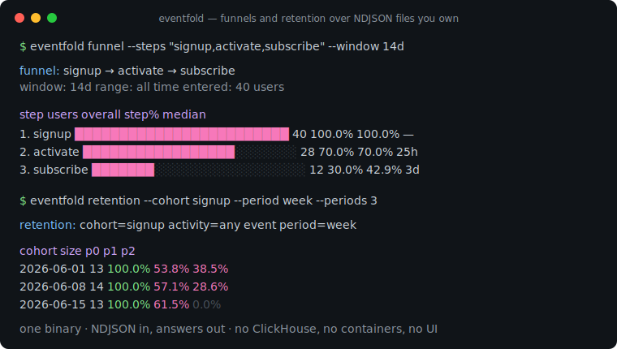
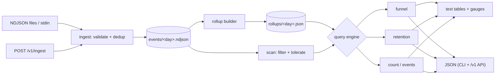

# eventfold

[English](README.md) | [中文](README.zh.md) | [日本語](README.ja.md)

[](LICENSE) [](go.mod) [](CHANGELOG.md)  [](CONTRIBUTING.md)

**eventfold：オープンソースのシングルバイナリ・プロダクト分析エンジン——イベントを自分の手元の NDJSON ファイルに取り込み、CLI またはローカル JSON API からファネル・リテンション・トレンドを照会。ClickHouse も、コンテナ群も、UI も不要。**



```bash
git clone https://github.com/JaydenCJ/eventfold && cd eventfold
go build -o eventfold ./cmd/eventfold    # single static binary, stdlib only
```

> プレリリース：v0.1.0 はまだどのパッケージレジストリにも公開されていません。上記の手順でソースからビルドしてください（Go ≥1.22 であれば可）。

## なぜ eventfold？

どのインディープロダクトにも必要な答えは同じ 3 つ——*ファネルを何人が通過するのか、ユーザーは戻ってくるのか、利用は伸びているのか？*——なのに、それを得る標準的な手段はどれも問いより重い。Mixpanel や Amplitude はイベント数で課金し、データを囲い込む。セルフホストの PostHog は正直にプラットフォームであり、最初のチャートを描く前に ClickHouse、Postgres、Redis と worker 群の構築が要る。エクスポートに対する手書き SQL は一度だけ答えて、あとは腐っていく。eventfold は問いと同じサイズだ：1 つの Go バイナリが、イベントをディスク上の日付パーティション NDJSON に追記し、ウィンドウ付きファネル（再アンカリング、各ステップ到達の中央値時間、プロパティ別セグメント対応）、月曜始まりのコホート・リテンション三角、rollup で加速されたトレンド集計を計算する——人間には CLI、スクリプトにはループバック JSON API、両者は同一クエリエンジンを共有するため数字が食い違うことはない。

| | eventfold | Mixpanel | セルフホスト PostHog | DuckDB + SQL |
|---|---|---|---|---|
| 実行形態 | バイナリ 1 つ | SaaS | 約 6 コンテナ構成 | ライブラリ + 自作コード |
| イベントは自分のディスクに残り grep できる | ✅ NDJSON | ❌ | ✅ ClickHouse 内 | ✅ |
| ウィンドウ付き多段ファネルを内蔵 | ✅ | ✅ | ✅ | ❌ SQL を書く |
| コホート・リテンション三角を内蔵 | ✅ | ✅ | ✅ | ❌ SQL を書く |
| 冪等な再取り込み（イベント id） | ✅ | ✅ | ✅ | ❌ 手作業 |
| 完全オフライン・テレメトリなし | ✅ | ❌ | ⚠️ 既定で外部送信あり | ✅ |
| 1,000 万イベント時のコスト | ディスク容量 | $$$ | 運用の手間 | 開発の手間 |
| ランタイム依存 | 0 | 対象外 | ClickHouse、Postgres、Redis… | 1（DuckDB） |

<sub>依存数は 2026-07-13 に確認：eventfold は Go 標準ライブラリのみを import。PostHog セルフホストの "hobby" compose ファイルは ClickHouse、Postgres、Redis、Kafka、オブジェクトストレージを立ち上げる。</sub>

## 特長

- **嘘をつかないファネル** — すべての第 1 ステップ出現をアンカーとして試行するため、1 月に停滞して 3 月に転換したユーザーも数えられる。素朴なファーストタッチ型ファネルは、まさに研究したいユーザーを落とす。同一タイムスタンプは取り込み順で決定的に解決。
- **リテンション三角** — 各ユーザーの*最初の*コホートイベントを基準に、日または週（月曜始まり、UTC）でコホート化。アクティビティは指定イベントでも任意イベントでも、テキストでも JSON でも。
- **セグメントと所要時間** — `--by plan` で任意のファネルを第 1 ステップのプロパティ別に分割。各ステップがエントリーからの中央値時間を報告するので、ユーザーが*どこで*迷うかまで見える。
- **データベースではなく rollup ファイル** — `eventfold rollup` がソースファイルサイズを指紋として日次集計を事前計算。新鮮な rollup は日次カウントに即答し、古いものは自動的にスキャンへフォールバック。`rollups/` の削除は常に安全。
- **あなたが所有するファイル** — イベントは追記専用・日付パーティションの NDJSON に、正規化され文書化された形式で保存（[docs/file-format.md](docs/file-format.md)）。任意の `id` キーで同じエクスポートの再取り込みは no-op になる。
- **CLI と JSON API は同一エンジン** — `eventfold serve` は `/v1/funnel`、`/v1/retention`、`/v1/count`、`/v1/events`、`/v1/ingest` をループバックのみで公開（非ループバックのバインドは拒否）。API と CLI は同じクエリコードを呼ぶ。
- **依存ゼロ・完全オフライン** — Go 標準ライブラリのみ、テレメトリなし、起動時のネットワークアクセスなし。終了コード（0/1/2/3）は安定していてスクリプトから扱える。

## クイックスタート

```bash
# generate a deterministic 40-user demo dataset and ingest it
bash examples/seed-demo.sh /tmp/eventfold-demo

# how do users convert, and how fast?
./eventfold funnel --dir /tmp/eventfold-demo --steps "signup,activate,subscribe" --window 14d
```

実際にキャプチャした出力：

```text
funnel: signup → activate → subscribe
window: 14d   range: all time   entered: 40 users

step                                     users  overall   step%      median
1. signup     ████████████████████████       40   100.0%  100.0%           —
2. activate   █████████████████░░░░░░░       28    70.0%   70.0%         25h
3. subscribe  ███████░░░░░░░░░░░░░░░░░       12    30.0%   42.9%          3d
```

ユーザーは戻ってくるか？（`eventfold retention --cohort signup --periods 4`、実出力）：

```text
retention: cohort=signup activity=any event period=week   range: all time

cohort       size      p0      p1      p2      p3
2026-06-01     13  100.0%   53.8%   38.5%    0.0%
2026-06-08     14  100.0%   57.1%   28.6%    0.0%
2026-06-15     13  100.0%   61.5%    0.0%    0.0%
```

日次カウントは事前計算した rollup から返る（`eventfold rollup` を一度実行して構築）。週次カウントはユーザーの重複排除が必要なため生ファイルを走査する——`source` 列が常にどちらの経路で答えたかを示す（`eventfold count --event signup --by week`、実出力）：

```text
count: signup by week

bucket         count     users  source
2026-06-01        13        13  scan
2026-06-08        14        14  scan
2026-06-15        13        13  scan

40 events across 3 buckets
```

どのクエリにも `--format json` を付ければ安定した機械向けエンベロープ（`"schema_version": 1`）が得られる。API を起動するなら `./eventfold serve --dir /tmp/eventfold-demo` の後に `curl "http://127.0.0.1:8991/v1/funnel?steps=signup,activate&window=7d"` で同じ結果が返る。

## CLI リファレンス

`eventfold <ingest|funnel|retention|count|events|rollup|serve|version>`——すべてのコマンドが `--dir PATH`（既定 `./eventfold-data`）を受け付け、クエリコマンドは `--since`/`--until YYYY-MM-DD` と `--format text|json` を受け付ける。終了コード：0 成功、1 strict 取り込み失敗、2 使い方エラー、3 実行時エラー。

| フラグ | 既定値 | 効果 |
|---|---|---|
| `--steps`（funnel） | — | 順序付きステップイベント。例 `"signup,activate,pay"`（2–12、重複可） |
| `--window`（funnel） | `7d` | 第 1 ステップからの最大時間：`30m`、`6h`、`7d`、`2w` |
| `--by`（funnel） | — | 第 1 ステップイベントのこのプロパティでセグメント |
| `--cohort`（retention） | — | コホートを定義するイベント（必須） |
| `--activity`（retention） | 任意イベント | 「戻ってきた」と数えるイベント |
| `--period`（retention） | `week` | コホート粒度：`day` または `week`（月曜始まり、UTC） |
| `--periods`（retention） | `8` | 三角の幅、2–52 |
| `--event`、`--by`（count） | —、`day` | 集計対象イベント、`day` または `week` でバケット化 |
| `--strict`、`--quiet`（ingest） | オフ | 無効行があれば終了コード 1 / 行単位エラーを抑制 |
| `--force`（rollup） | オフ | rollup が新鮮でも再構築 |
| `--addr`（serve） | `127.0.0.1:8991` | 待ち受けアドレス。ループバック必須 |

## JSON API

`eventfold serve` はループバックのみにバインドする——外部公開は既定ではなく、意図的にリバースプロキシ側の判断とした。`POST /v1/ingest` は NDJSON ボディ（上限 16 MiB）を受け取り `{written, duplicates, invalid}` を返す。クエリエンドポイントは CLI フラグをクエリパラメータとして鏡写しにし、`--format json` と同じエンベロープを返す。

| エンドポイント | メソッド | パラメータ |
|---|---|---|
| `/v1/health` | GET | — |
| `/v1/ingest` | POST | NDJSON ボディ |
| `/v1/funnel` | GET | `steps`、`window`、`by`、`since`、`until` |
| `/v1/retention` | GET | `cohort`、`activity`、`period`、`periods`、`since`、`until` |
| `/v1/count` | GET | `event`、`by`、`since`、`until` |
| `/v1/events` | GET | `since`、`until` |

## 検証

このリポジトリは CI を同梱しない。上記の主張はすべてローカル実行で検証される：

```bash
go test ./...            # 88 deterministic tests, offline, < 5 s
bash scripts/smoke.sh    # end-to-end CLI check, prints SMOKE OK
```

## アーキテクチャ



## ロードマップ

- [x] v0.1.0 — 日付パーティション NDJSON ストア、冪等な取り込み、再アンカリング・中央値・セグメント対応ファネル、日/週リテンション三角、指紋付き rollup、ループバック JSON API、88 テスト + smoke スクリプト
- [ ] `compact` コマンド：古いパーティションを月次ファイルに畳み込みマニフェストを生成
- [ ] 全クエリでのプロパティフィルタ（`--where plan=pro`）
- [ ] スケッチによるユニークユーザー rollup で、週次カウントの生スキャンを不要に
- [ ] `eventfold tail`：進行中の取り込みをライブ表示
- [ ] ファーストクラスのインポーター（Mixpanel/Amplitude/PostHog エクスポート形式）

全リストは [open issues](https://github.com/JaydenCJ/eventfold/issues) を参照。

## コントリビュート

issue・ディスカッション・pull request を歓迎——ローカルワークフロー（フォーマット、vet、テスト、`SMOKE OK`）は [CONTRIBUTING.md](CONTRIBUTING.md) を参照。入門タスクには [good first issue](https://github.com/JaydenCJ/eventfold/issues?q=is%3Aissue+is%3Aopen+label%3A%22good+first+issue%22) のラベルが付き、設計の議論は [Discussions](https://github.com/JaydenCJ/eventfold/discussions) で。

## ライセンス

[MIT](LICENSE)
