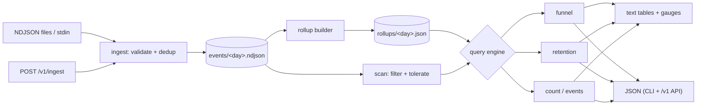

# eventfold

[English](README.md) | [中文](README.zh.md) | [日本語](README.ja.md)

[](LICENSE) [](go.mod) [](CHANGELOG.md)  [](CONTRIBUTING.md)

**eventfold：an open-source, single-binary product-analytics engine — ingest events into NDJSON files you own, then query funnels, retention and trends from the CLI or a local JSON API. No ClickHouse, no container fleet, no UI.**


```bash
git clone https://github.com/JaydenCJ/eventfold && cd eventfold
go build -o eventfold ./cmd/eventfold    # single static binary, stdlib only
```

> Pre-release: v0.1.0 is not tagged on a package registry yet; build from source as above (any Go ≥1.22).

## Why eventfold?

Every indie product needs the same three answers — *how many people convert through my funnel, do they come back, and is usage growing?* — and the standard ways to get them are all heavier than the question. Mixpanel and Amplitude meter your events and own your data. Self-hosted PostHog is honest about being a platform: ClickHouse, Postgres, Redis and a worker fleet before the first chart renders. Hand-rolled SQL over exports answers each question once, then rots. eventfold is the size of the question: one Go binary that appends events to day-partitioned NDJSON files on your disk and computes windowed funnels (with re-anchoring, median time-to-step and property segmentation), Monday-start cohort retention triangles, and rollup-accelerated trend counts — from the CLI for you, from a loopback JSON API for your scripts, both sharing the same query engine so the numbers can never disagree.

| | eventfold | Mixpanel | self-hosted PostHog | DuckDB + SQL |
|---|---|---|---|---|
| Runs as | 1 binary | SaaS | ~6-container fleet | library + your code |
| Your events stay on your disk, greppable | ✅ NDJSON | ❌ | ✅ inside ClickHouse | ✅ |
| Windowed multi-step funnels built in | ✅ | ✅ | ✅ | ❌ write the SQL |
| Cohort retention triangles built in | ✅ | ✅ | ✅ | ❌ write the SQL |
| Idempotent re-ingestion (event ids) | ✅ | ✅ | ✅ | ❌ manual |
| Works fully offline, zero telemetry | ✅ | ❌ | ⚠️ phones home by default | ✅ |
| Cost at 10M events | disk space | $$$ | your ops time | your dev time |
| Runtime dependencies | 0 | n/a | ClickHouse, Postgres, Redis… | 1 (DuckDB) |

<sub>Dependency counts checked 2026-07-13: eventfold imports the Go standard library only; the PostHog self-hosted "hobby" compose file provisions ClickHouse, Postgres, Redis, Kafka and object storage.</sub>

## Features

- **Funnels that don't lie** — every first-step occurrence is tried as an anchor, so a user who stalls in January and converts in March still counts; naive first-touch funnels drop exactly the users you want to study. Equal timestamps resolve by ingestion order, deterministically.
- **Retention triangles** — day or week cohorts (Monday-start, UTC) from each user's *first* cohort event, with named or any-event activity, as text or JSON.
- **Segmentation and timing** — `--by plan` splits any funnel by a first-step property; every step reports median time-from-entry, so you see *where* users hesitate, not just where they quit.
- **Rollup files, not a database** — `eventfold rollup` precomputes per-day aggregates fingerprinted by source-file size; fresh rollups answer daily counts instantly, stale ones fall back to scanning automatically, and deleting `rollups/` is always safe.
- **Files you own** — events live in append-only, day-partitioned NDJSON with a documented, canonicalized format ([docs/file-format.md](docs/file-format.md)); optional `id` keys make re-ingesting the same export a no-op.
- **CLI and JSON API, one engine** — `eventfold serve` exposes `/v1/funnel`, `/v1/retention`, `/v1/count`, `/v1/events` and `/v1/ingest` on loopback only (non-loopback binds are refused); the API and CLI call the same query code.
- **Zero dependencies, fully offline** — Go standard library only, no telemetry, no network at startup; exit codes (0/1/2/3) are stable for scripting.

## Quickstart

```bash
# generate a deterministic 40-user demo dataset and ingest it
bash examples/seed-demo.sh /tmp/eventfold-demo

# how do users convert, and how fast?
./eventfold funnel --dir /tmp/eventfold-demo --steps "signup,activate,subscribe" --window 14d
```

Real captured output:

```text
funnel: signup → activate → subscribe
window: 14d   range: all time   entered: 40 users

step                                     users  overall   step%      median
1. signup     ████████████████████████       40   100.0%  100.0%           —
2. activate   █████████████████░░░░░░░       28    70.0%   70.0%         25h
3. subscribe  ███████░░░░░░░░░░░░░░░░░       12    30.0%   42.9%          3d
```

Do they come back? (`eventfold retention --cohort signup --periods 4`, real output):

```text
retention: cohort=signup activity=any event period=week   range: all time

cohort       size      p0      p1      p2      p3
2026-06-01     13  100.0%   53.8%   38.5%    0.0%
2026-06-08     14  100.0%   57.1%   28.6%    0.0%
2026-06-15     13  100.0%   61.5%    0.0%    0.0%
```

Daily counts are served from precomputed rollups (build them once with `eventfold rollup`); weekly counts dedup users so they scan raw files — the `source` column always shows which path answered (`eventfold count --event signup --by week`, real output):

```text
count: signup by week

bucket         count     users  source
2026-06-01        13        13  scan
2026-06-08        14        14  scan
2026-06-15        13        13  scan

40 events across 3 buckets
```

Add `--format json` to any query for a stable machine envelope (`"schema_version": 1`), or start the API: `./eventfold serve --dir /tmp/eventfold-demo` and `curl "http://127.0.0.1:8991/v1/funnel?steps=signup,activate&window=7d"` returns the same result.

## CLI reference

`eventfold <ingest|funnel|retention|count|events|rollup|serve|version>` — every command takes `--dir PATH` (default `./eventfold-data`); query commands take `--since`/`--until YYYY-MM-DD` and `--format text|json`. Exit codes: 0 ok, 1 strict-ingest failure, 2 usage error, 3 runtime error.

| Flag | Default | Effect |
|---|---|---|
| `--steps` (funnel) | — | ordered step events, e.g. `"signup,activate,pay"` (2–12, repeats allowed) |
| `--window` (funnel) | `7d` | max time from first step: `30m`, `6h`, `7d`, `2w` |
| `--by` (funnel) | — | segment by this property of the first-step event |
| `--cohort` (retention) | — | cohort-defining event (required) |
| `--activity` (retention) | any event | event that counts as "came back" |
| `--period` (retention) | `week` | cohort bucket: `day` or `week` (Monday-start, UTC) |
| `--periods` (retention) | `8` | triangle width, 2–52 |
| `--event`, `--by` (count) | —, `day` | event to count, bucketed by `day` or `week` |
| `--strict`, `--quiet` (ingest) | off | exit 1 on any invalid line / silence per-line errors |
| `--force` (rollup) | off | rebuild rollups even when fresh |
| `--addr` (serve) | `127.0.0.1:8991` | listen address; must be loopback |

## JSON API

`eventfold serve` binds loopback only — exposing it publicly is deliberately a reverse-proxy decision, not a default. `POST /v1/ingest` accepts an NDJSON body (16 MiB cap) and reports `{written, duplicates, invalid}`; the query endpoints mirror the CLI flags as query parameters and return the same envelope as `--format json`.

| Endpoint | Method | Parameters |
|---|---|---|
| `/v1/health` | GET | — |
| `/v1/ingest` | POST | NDJSON body |
| `/v1/funnel` | GET | `steps`, `window`, `by`, `since`, `until` |
| `/v1/retention` | GET | `cohort`, `activity`, `period`, `periods`, `since`, `until` |
| `/v1/count` | GET | `event`, `by`, `since`, `until` |
| `/v1/events` | GET | `since`, `until` |

## Verification

This repository ships no CI; every claim above is verified by local runs:

```bash
go test ./...            # 88 deterministic tests, offline, < 5 s
bash scripts/smoke.sh    # end-to-end CLI check, prints SMOKE OK
```

## Architecture



## Roadmap

- [x] v0.1.0 — day-partitioned NDJSON store, idempotent ingest, re-anchoring funnels with medians and segmentation, day/week retention triangles, fingerprinted rollups, loopback JSON API, 88 tests + smoke script
- [ ] `compact` command: fold old partitions into per-month files with a manifest
- [ ] Property filters on all queries (`--where plan=pro`)
- [ ] Unique-user rollups via sketches, so weekly counts stop needing raw scans
- [ ] `eventfold tail` live view for a running ingest
- [ ] First-class importers (Mixpanel/Amplitude/PostHog export formats)

See the [open issues](https://github.com/JaydenCJ/eventfold/issues) for the full list.

## Contributing

Issues, discussions and pull requests are welcome — see [CONTRIBUTING.md](CONTRIBUTING.md) for the local workflow (format, vet, tests, `SMOKE OK`). Good entry points are labelled [good first issue](https://github.com/JaydenCJ/eventfold/issues?q=is%3Aissue+is%3Aopen+label%3A%22good+first+issue%22), and design questions live in [Discussions](https://github.com/JaydenCJ/eventfold/discussions).

## License

[MIT](LICENSE)
