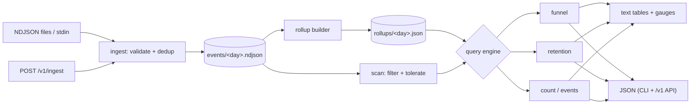

# eventfold

[English](README.md) | [中文](README.zh.md) | [日本語](README.ja.md)

[](LICENSE) [](go.mod) [](CHANGELOG.md)  [](CONTRIBUTING.md)

**eventfold：开源的单二进制产品分析引擎——把事件写入你自己掌控的 NDJSON 文件，然后在 CLI 或本地 JSON API 中查询漏斗、留存和趋势。不需要 ClickHouse，不需要容器集群，不需要 UI。**


```bash
git clone https://github.com/JaydenCJ/eventfold && cd eventfold
go build -o eventfold ./cmd/eventfold    # single static binary, stdlib only
```

> 预发布：v0.1.0 尚未发布到任何包注册表；请按上述方式从源码构建（Go ≥1.22 均可）。

## 为什么选择 eventfold？

每个独立产品都需要同样三个答案——*有多少人走完我的漏斗、他们会不会回来、使用量在不在增长？*——而获取答案的标准方式全都比问题本身更重。Mixpanel 和 Amplitude 按事件计费并占有你的数据。自托管 PostHog 坦诚自己是一个平台：先部署 ClickHouse、Postgres、Redis 和一队 worker，才能渲染第一张图表。针对导出文件手写的 SQL 只能回答一次，然后就开始腐烂。eventfold 的体量与问题相称：一个 Go 二进制，把事件追加到你磁盘上按日分区的 NDJSON 文件中，并计算带窗口的漏斗（支持重新锚定、到达各步的中位耗时、属性分组）、周一起始的同期群留存三角，以及由 rollup 加速的趋势计数——CLI 供你使用，回环 JSON API 供你的脚本使用，两者共享同一查询引擎，数字永远不会互相矛盾。

| | eventfold | Mixpanel | 自托管 PostHog | DuckDB + SQL |
|---|---|---|---|---|
| 运行形态 | 1 个二进制 | SaaS | 约 6 个容器的集群 | 库 + 你的代码 |
| 事件留在你的磁盘上、可 grep | ✅ NDJSON | ❌ | ✅ 在 ClickHouse 内 | ✅ |
| 内置带窗口的多步漏斗 | ✅ | ✅ | ✅ | ❌ 自己写 SQL |
| 内置同期群留存三角 | ✅ | ✅ | ✅ | ❌ 自己写 SQL |
| 幂等重复摄入（事件 id） | ✅ | ✅ | ✅ | ❌ 手动处理 |
| 完全离线、零遥测 | ✅ | ❌ | ⚠️ 默认回传数据 | ✅ |
| 1000 万事件的成本 | 磁盘空间 | $$$ | 你的运维时间 | 你的开发时间 |
| 运行时依赖 | 0 | 不适用 | ClickHouse、Postgres、Redis… | 1（DuckDB） |

<sub>依赖数量核对于 2026-07-13：eventfold 仅导入 Go 标准库；PostHog 自托管 "hobby" compose 文件需要部署 ClickHouse、Postgres、Redis、Kafka 与对象存储。</sub>

## 特性

- **不说谎的漏斗** — 每一次首步事件都会作为锚点尝试，一月停滞、三月转化的用户仍会被计入；朴素的首次触达漏斗恰恰丢掉你最想研究的用户。相同时间戳按摄入顺序确定性地排序。
- **留存三角** — 以每个用户*首次*同期群事件为准，按日或周（周一起始，UTC）分组，活动事件可指定或任意，输出文本或 JSON。
- **分组与耗时** — `--by plan` 按首步事件的属性拆分任意漏斗；每一步都报告从进入起的中位耗时，让你看到用户在*哪里*犹豫，而不只是在哪里流失。
- **rollup 文件而非数据库** — `eventfold rollup` 预计算按日聚合，用源文件大小做指纹；新鲜的 rollup 即刻回答每日计数，过期的自动回退到扫描，删除 `rollups/` 永远安全。
- **属于你的文件** — 事件存放在追加式、按日分区的 NDJSON 中，格式规范化且有文档（[docs/file-format.md](docs/file-format.md)）；可选的 `id` 键让重复摄入同一份导出成为空操作。
- **CLI 与 JSON API 同一引擎** — `eventfold serve` 仅在回环地址上暴露 `/v1/funnel`、`/v1/retention`、`/v1/count`、`/v1/events` 和 `/v1/ingest`（拒绝绑定非回环地址）；API 与 CLI 调用同一份查询代码。
- **零依赖、完全离线** — 仅 Go 标准库，无遥测，启动时不联网；退出码（0/1/2/3）稳定，便于脚本化。

## 快速上手

```bash
# generate a deterministic 40-user demo dataset and ingest it
bash examples/seed-demo.sh /tmp/eventfold-demo

# how do users convert, and how fast?
./eventfold funnel --dir /tmp/eventfold-demo --steps "signup,activate,subscribe" --window 14d
```

真实捕获的输出：

```text
funnel: signup → activate → subscribe
window: 14d   range: all time   entered: 40 users

step                                     users  overall   step%      median
1. signup     ████████████████████████       40   100.0%  100.0%           —
2. activate   █████████████████░░░░░░░       28    70.0%   70.0%         25h
3. subscribe  ███████░░░░░░░░░░░░░░░░░       12    30.0%   42.9%          3d
```

他们会回来吗？（`eventfold retention --cohort signup --periods 4`，真实输出）：

```text
retention: cohort=signup activity=any event period=week   range: all time

cohort       size      p0      p1      p2      p3
2026-06-01     13  100.0%   53.8%   38.5%    0.0%
2026-06-08     14  100.0%   57.1%   28.6%    0.0%
2026-06-15     13  100.0%   61.5%    0.0%    0.0%
```

按天计数由预计算的 rollup 回答（用 `eventfold rollup` 构建一次即可）；按周计数需要对用户去重，因此会扫描原始文件——`source` 列始终展示实际回答路径（`eventfold count --event signup --by week`，真实输出）：

```text
count: signup by week

bucket         count     users  source
2026-06-01        13        13  scan
2026-06-08        14        14  scan
2026-06-15        13        13  scan

40 events across 3 buckets
```

在任意查询上加 `--format json` 可获得稳定的机器信封（`"schema_version": 1`），或启动 API：`./eventfold serve --dir /tmp/eventfold-demo`，然后 `curl "http://127.0.0.1:8991/v1/funnel?steps=signup,activate&window=7d"` 返回同样的结果。

## CLI 参考

`eventfold <ingest|funnel|retention|count|events|rollup|serve|version>`——每个命令都接受 `--dir PATH`（默认 `./eventfold-data`）；查询命令接受 `--since`/`--until YYYY-MM-DD` 与 `--format text|json`。退出码：0 成功，1 严格摄入失败，2 用法错误，3 运行时错误。

| 参数 | 默认值 | 作用 |
|---|---|---|
| `--steps`（funnel） | — | 有序步骤事件，如 `"signup,activate,pay"`（2–12 步，允许重复） |
| `--window`（funnel） | `7d` | 距首步的最大时长：`30m`、`6h`、`7d`、`2w` |
| `--by`（funnel） | — | 按首步事件的该属性分组 |
| `--cohort`（retention） | — | 定义同期群的事件（必填） |
| `--activity`（retention） | 任意事件 | 计为"回访"的事件 |
| `--period`（retention） | `week` | 同期群粒度：`day` 或 `week`（周一起始，UTC） |
| `--periods`（retention） | `8` | 三角宽度，2–52 |
| `--event`、`--by`（count） | —、`day` | 要统计的事件，按 `day` 或 `week` 分桶 |
| `--strict`、`--quiet`（ingest） | 关 | 任一无效行即以退出码 1 结束 / 静默逐行错误 |
| `--force`（rollup） | 关 | 即使 rollup 新鲜也强制重建 |
| `--addr`（serve） | `127.0.0.1:8991` | 监听地址；必须为回环地址 |

## JSON API

`eventfold serve` 只绑定回环地址——对外暴露被有意设计为一个反向代理层面的决定，而非默认行为。`POST /v1/ingest` 接受 NDJSON 请求体（上限 16 MiB）并返回 `{written, duplicates, invalid}`；查询端点以查询参数镜像 CLI 参数，返回与 `--format json` 相同的信封。

| 端点 | 方法 | 参数 |
|---|---|---|
| `/v1/health` | GET | — |
| `/v1/ingest` | POST | NDJSON 请求体 |
| `/v1/funnel` | GET | `steps`、`window`、`by`、`since`、`until` |
| `/v1/retention` | GET | `cohort`、`activity`、`period`、`periods`、`since`、`until` |
| `/v1/count` | GET | `event`、`by`、`since`、`until` |
| `/v1/events` | GET | `since`、`until` |

## 验证

本仓库不附带 CI；以上所有声明均由本地运行验证：

```bash
go test ./...            # 88 deterministic tests, offline, < 5 s
bash scripts/smoke.sh    # end-to-end CLI check, prints SMOKE OK
```

## 架构



## 路线图

- [x] v0.1.0 — 按日分区的 NDJSON 存储、幂等摄入、支持重新锚定/中位耗时/分组的漏斗、日/周留存三角、带指纹的 rollup、回环 JSON API、88 个测试 + smoke 脚本
- [ ] `compact` 命令：将旧分区折叠为按月文件并生成清单
- [ ] 所有查询支持属性过滤（`--where plan=pro`）
- [ ] 基于 sketch 的去重用户 rollup，让周计数不再需要扫描原始数据
- [ ] `eventfold tail`：实时查看正在进行的摄入
- [ ] 一等公民导入器（Mixpanel/Amplitude/PostHog 导出格式）

完整列表见 [open issues](https://github.com/JaydenCJ/eventfold/issues)。

## 贡献

欢迎 issue、讨论与 pull request——本地工作流（格式化、vet、测试、`SMOKE OK`）见 [CONTRIBUTING.md](CONTRIBUTING.md)。入门任务标注为 [good first issue](https://github.com/JaydenCJ/eventfold/issues?q=is%3Aissue+is%3Aopen+label%3A%22good+first+issue%22)，设计讨论在 [Discussions](https://github.com/JaydenCJ/eventfold/discussions)。

## 许可证

[MIT](LICENSE)
